# Brewet User Guide

Brewet is a community plugin for the Red Hat OpenShift AI (RHOAI) Dashboard that brings S3 and PVC storage management directly into the dashboard. You can deploy a per-project storage backend, browse and manage files across S3 buckets and PVC-mounted volumes, transfer data between storage locations, import models from HuggingFace, and configure storage settings — all without leaving the RHOAI dashboard.

## Navigation

Brewet adds three pages to the RHOAI dashboard sidebar under **Community Plugins > Brewet**:

| Page | Purpose |
|---|---|
| **Storage Browser** | Browse, upload, download, preview, and manage files across S3 and PVC locations |
| **Storage Management** | View all storage locations, create and delete S3 buckets |
| **Settings** | Configure S3, HuggingFace, proxy, and performance settings |

A persistent toolbar appears at the top of every page, containing the project selector and container status controls. The selected project and storage location persist across page navigation.

## Projects

### Selecting a project

The project selector dropdown in the toolbar lists all OpenShift projects (namespaces) available to you. Each project runs its own independent Brewet storage backend.

Type in the search field to filter projects by name. The filter uses fuzzy matching, so partial or out-of-order terms still find results.

### Favorites

Click the star icon next to any project to mark it as a favorite. Favorites appear in a separate group at the top of the dropdown for quick access.

### System namespaces

By default, system namespaces (those starting with `openshift-`, `kube-`, or named `default`/`openshift`) are hidden. Toggle **Show default projects** at the bottom of the dropdown to reveal them.

### Creating a new project

Click **Create Project** at the bottom of the project selector to open the creation modal.

- **Name** — A display name for the project (required).
- **Resource name** — Automatically derived from the display name. Click **Edit resource name** to override it. Must be lowercase alphanumeric with hyphens, maximum 30 characters.
- **Description** — Optional free-text description.

The new project appears in the selector immediately after creation.

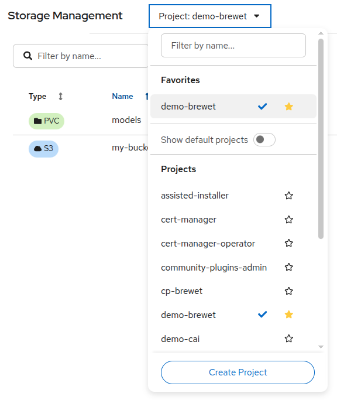

## Container Lifecycle

Before you can use the Storage Browser, Storage Management, or Settings pages, you must set up a Brewet storage backend in the selected project. The toolbar shows the current container status and provides controls to manage it.

### Container states

| Status | Indicator | Meaning |
|---|---|---|
| **Not Set Up** | Grey label | No Brewet deployment exists in this project |
| **Stopped** | Grey label | Deployment exists but is scaled to zero |
| **Starting** | Blue label with spinner | Deployment is scaling up, pods not yet ready |
| **Running** | Green label | Storage backend is ready to serve requests |
| **Error** | Red label | Deployment failed (deadline exceeded or pod crash) |

### Setting up Brewet

Click **Set Up Brewet** to open the setup wizard. The wizard has four steps:

#### Step 1: Data Connection

Select an S3 Data Connection from your project. Data Connections are Kubernetes Secrets that store S3 credentials (endpoint, access key, secret key, region, bucket). Each connection is shown with its name and endpoint URL.

If you only need PVC storage, select **None (PVC storage only)** to skip S3 configuration.

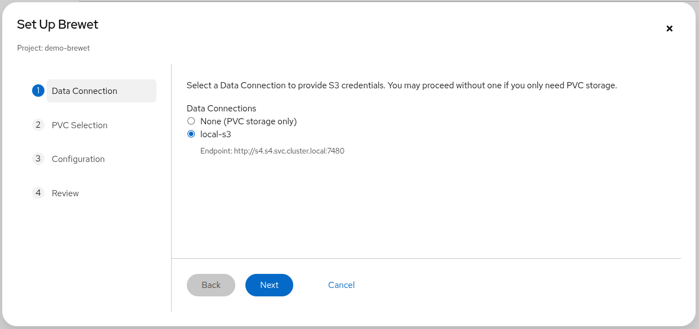

#### Step 2: PVC Selection

Select which PersistentVolumeClaims to mount in the storage backend. The table shows each PVC's name, capacity, and status.

When you select a PVC, a mount path field appears. The default mount path is `/mnt/pvc/<pvc-name>`, but you can customize it. Mount paths must be absolute and cannot overlap with each other or with system paths.

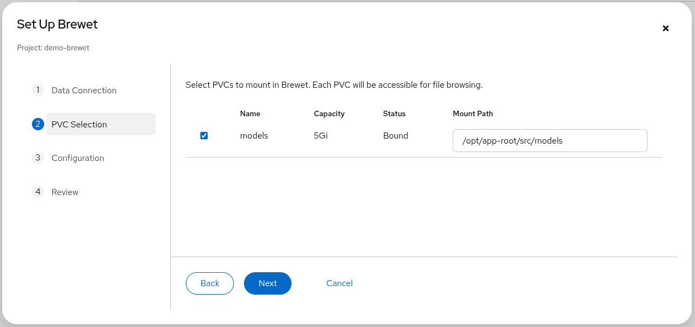

#### Step 3: Configuration (optional)

Configure optional settings that will be applied when the container starts:

- **HuggingFace** — API token for importing models from gated repositories.
- **Proxy** — HTTP and HTTPS proxy URLs if your cluster requires a proxy for external access.
- **Performance** — Max concurrent transfers (1–20, default 2) and max files per page (10–1000, default 100).

All fields are optional. You can change these later from the Settings page or by editing the container configuration.

#### Step 4: Review

A summary of your selections: project, Data Connection, PVC mounts (with paths), and all configuration values. HuggingFace tokens are masked for security.

Click **Create** to deploy the storage backend. A status modal shows the resources being created (Secret, Deployment, Service, NetworkPolicy) and the container startup progress.

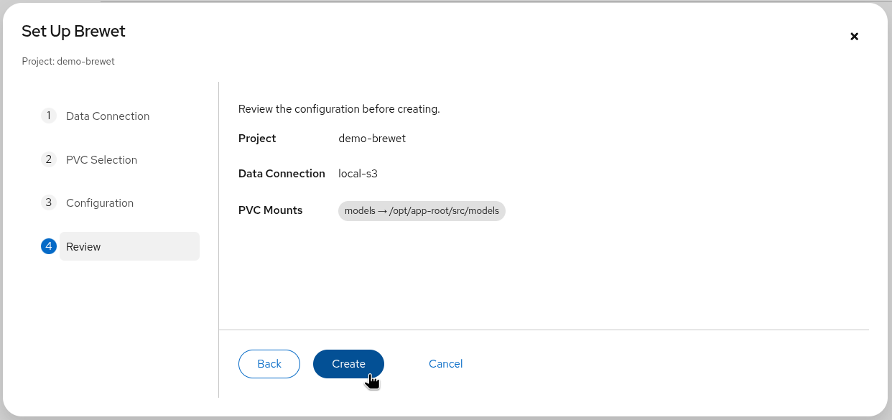

### Starting and stopping

- **Start Brewet** — Scales the deployment to one replica. The status changes to "Starting" and then "Running" once the pod is ready.
- **Stop Brewet** — Scales the deployment to zero replicas. The storage backend stops but all configuration is preserved.

### Editing configuration

Click the pencil icon to reopen the wizard in edit mode. You can change the Data Connection, PVC mounts, and optional settings. The wizard is pre-populated with the current configuration.

### Deleting Brewet

Click the trash icon to delete the storage backend from the project. This removes the Deployment, Service, NetworkPolicy, and settings Secret. A confirmation dialog warns you before proceeding. This does not delete your S3 data or PVCs — only the Brewet backend resources.

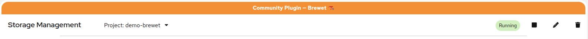

## Storage Browser

The Storage Browser is the main page for interacting with your files. It provides a unified view of S3 buckets and PVC-mounted directories.

### Selecting a storage location

Use the location dropdown at the top of the page to switch between storage locations. S3 buckets are shown with a cloud icon, PVC locations with a folder icon. Unavailable locations appear disabled with a red status label.

Your last selected location and path are remembered and restored when you return to the page.

### Navigating folders

- Click a folder row in the table to navigate into it.
- Use the breadcrumb trail above the table to navigate back to any parent folder.
- Click the **Copy Path** button (clipboard icon next to the breadcrumbs) to copy the current path.

### Searching

The search bar filters the file listing. Two search modes are available via the toggle next to the search field:

- **Prefix** — Matches files whose names start with the search text. For S3 locations with 3+ characters entered, this performs a server-side filtered query, which is faster for large buckets.
- **Contains** — Matches files whose names contain the search text anywhere. This is always client-side. For S3 locations, a warning appears if not all pages have been loaded, since the search only covers loaded files.

Search is debounced — results update 300ms after you stop typing.

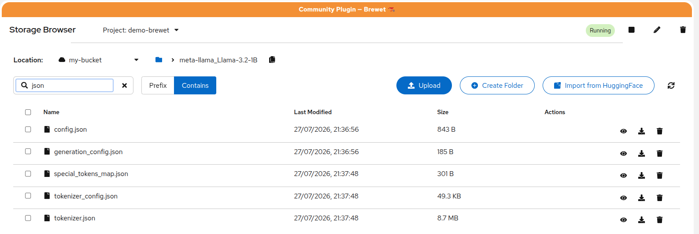

### Uploading files

Click **Upload** to open the upload modal. You can drag and drop files or folders onto the drop zone, or click to open a file picker. Folder uploads preserve the directory structure.

Each file shows its upload status:

- **Pending** — Queued, not yet started
- **Uploading** — Transfer in progress
- **Done** — Upload completed successfully
- **Error** — Upload failed
- **Cancelled** — Upload was cancelled by the user

Click **Cancel Upload** to abort all remaining uploads. The modal cannot be closed while uploads are active. When you close the modal after uploads finish, the file listing refreshes automatically.

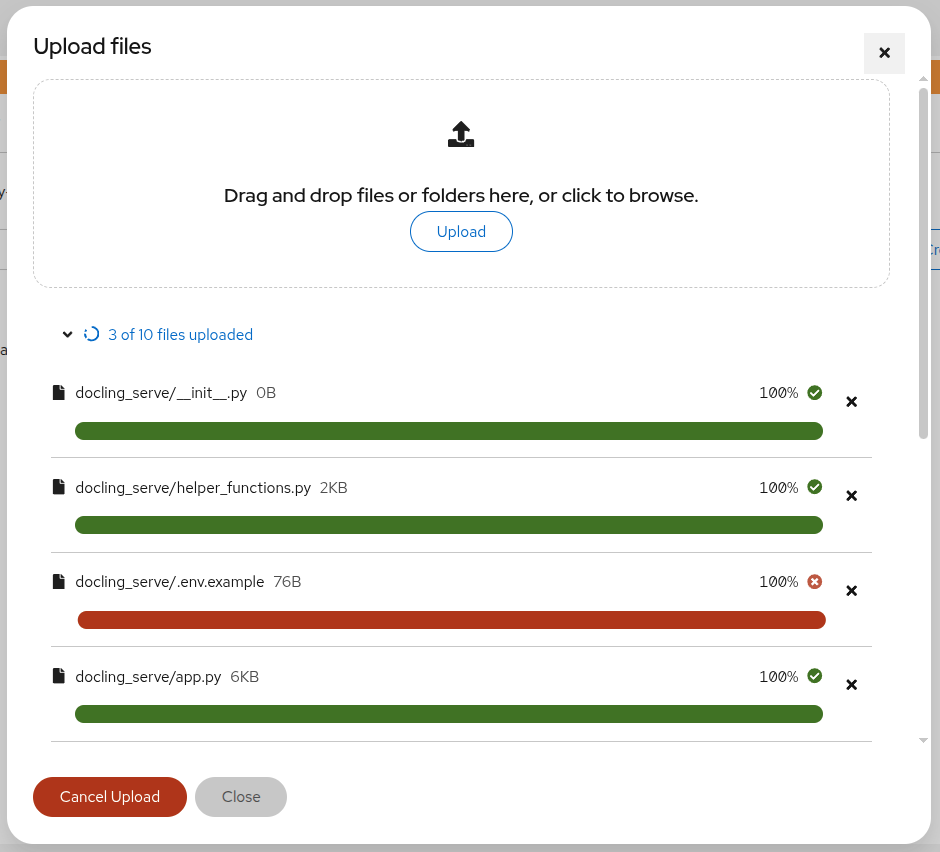

Note: some files in above screenshot are not uploaded because of the [extension filtering](#file-types).

### Creating folders

Click **Create Folder** and enter a name. Naming rules depend on the storage type:

- **S3** — Letters, numbers, and `! . _ * ' ( ) -` are allowed.
- **PVC** — Letters, numbers, periods, underscores, and hyphens are allowed.

Slashes and the names `.` and `..` are not allowed in either case.

### Downloading files

Click the download icon in a file's action column to download it. Downloads are only available for files, not folders.

### Previewing files

Click a file row or the eye icon to open a preview in a modal. Supported file types include:

| Category | Extensions |
|---|---|
| Images | `.png`, `.jpg`, `.jpeg`, `.gif`, `.bmp`, `.webp`, `.svg`, `.ico` |
| JSON | `.json`, `.jsonl`, `.geojson` |
| YAML | `.yaml`, `.yml` |
| Markdown | `.md`, `.mdx`, `.markdown` |
| Code | `.js`, `.jsx`, `.ts`, `.tsx`, `.py`, `.rb`, `.go`, `.rs`, `.java`, `.c`, `.cpp`, `.h`, `.cs`, `.swift`, `.kt`, `.scala`, `.r`, `.sql`, `.html`, `.css`, `.scss`, `.xml`, `.toml` |
| Text | `.txt`, `.log`, `.csv`, `.tsv`, `.ini`, `.cfg`, `.conf`, `.sh`, `.bash`, `.env`, `Makefile`, `Dockerfile` |

Text and code files display in a code block with a **Copy to clipboard** button. JSON files are pretty-printed. Images render inline. Unsupported file types show a message suggesting you download the file to view it.

The preview modal includes a **Download** button in the footer.

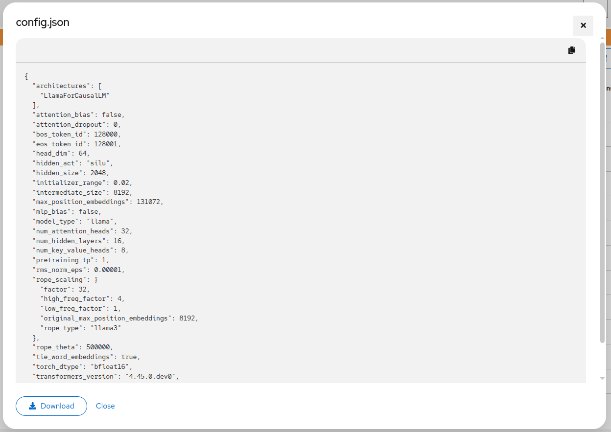

### Deleting files and folders

Click the trash icon on a file or folder row. A confirmation modal requires you to type the exact name of the item before the delete button becomes active. For folders, a warning notes that all contents will be permanently deleted.

### Multi-select and bulk actions

Use the checkboxes in the leftmost column to select multiple files. A select-all checkbox in the header toggles all items on the current page. When items are selected, a bulk action bar appears with:

- **Transfer to...** — Opens the transfer modal to move or copy the selected files to another location.
- **Delete Selected** — Opens a bulk delete confirmation. For multiple items, type the word "confirm" to proceed.
- **Clear Selection** — Deselects all items.

### Pagination

File listings are paginated. When more files are available beyond the current page, a **Load More** button appears at the bottom of the table. Click it to fetch the next page and append the results. The page size is configurable in Settings (default: 100 files per page).

## HuggingFace Import

Import models from the HuggingFace Hub directly into your current storage location.

### Starting an import

Click **Import from HuggingFace** in the Storage Browser toolbar to open the import modal.

- **Model ID** (required) — The HuggingFace repository identifier in `owner/model` format (e.g., `meta-llama/Llama-2-7b`).
- **HuggingFace Token** (optional) — Required for gated models. If you have already saved a token in Settings, it is pre-filled.
- **Exclude file extensions** — Comma-separated list of extensions to skip (e.g., `.onnx, .bin`). Files with these extensions will not be downloaded.

Files are imported into the currently selected location and folder path.

### Progress tracking

After clicking **Import**, the modal switches to a progress view:

- An overall progress bar shows completed files out of total files.
- Each file has its own row with status (pending, downloading, uploading, completed, failed) and progress bars: a blue bar for download progress and a green bar for upload-to-S3 progress.

### Cancelling an import

Click **Cancel Import** to stop the process. After cancellation, you can choose to **Keep Files** (retain whatever was already imported) or **Delete Files** (clean up partially imported files).

You can also close the modal while an import is in progress — the import continues in the background on the server.

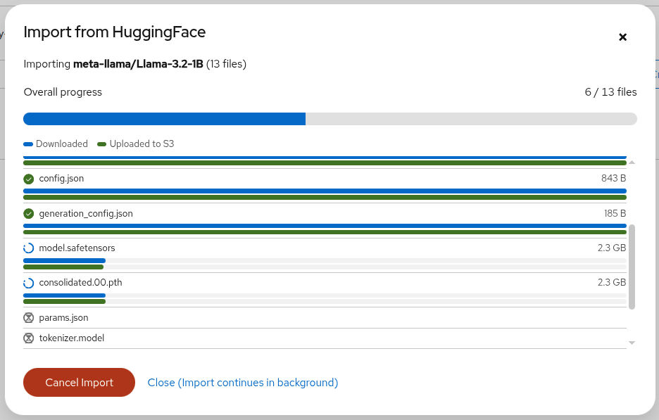

## Transfers

Transfer files between storage locations — for example, from an S3 bucket to a PVC mount, or between two S3 buckets.

### Starting a transfer

Select one or more files in the Storage Browser, then click **Transfer to...**. The transfer modal opens with three steps.

#### Step 1: Destination

A summary of the source files is shown at the top. Select a destination location from the dropdown (all locations except the source are listed). Browse into a specific destination folder using the folder list and breadcrumbs.

Toggle **Remove source files after transfer (move)** to control whether the source files are deleted after a successful transfer. This is checked by default (move semantics). Uncheck it to copy instead.

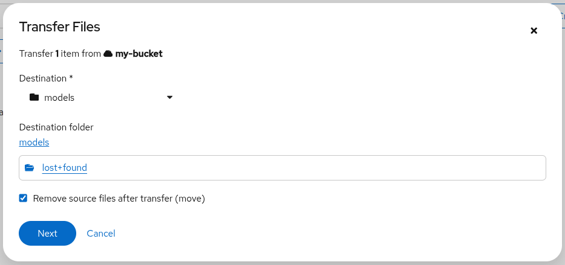

#### Step 2: Conflict resolution

This step only appears if any of the selected files already exist at the destination. A list of conflicting files is shown with their source and destination sizes. Choose a resolution strategy:

- **Overwrite existing files** — Replace destination files with source files.
- **Skip conflicting files** — Leave existing destination files untouched and only transfer non-conflicting files.
- **Rename with suffix** — Add a numeric suffix to transferred files (e.g., `model_1.safetensors`).

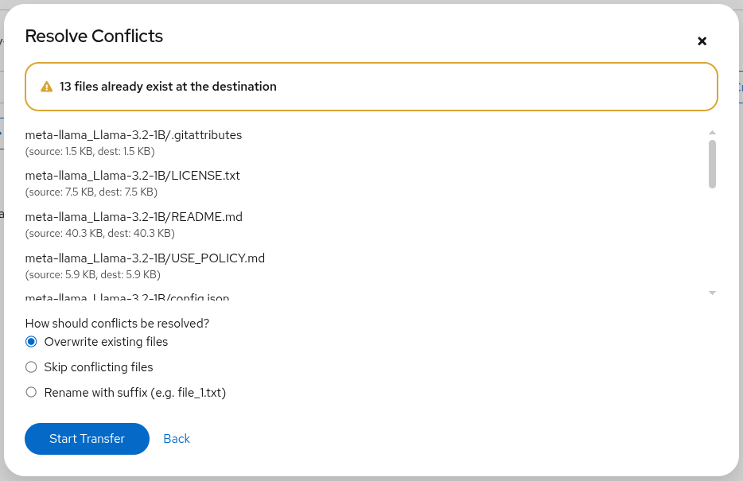

#### Step 3: Progress

A progress bar shows the number of files transferred and total bytes. The currently transferring file is displayed. If any files fail, a failure count appears.

Click **Cancel Transfer** to stop the process, or close the modal to let the transfer continue in the background. When the transfer completes, the Storage Browser file listing refreshes automatically.

## Storage Management

The Storage Management page provides an overview of all storage locations in the selected project.

### Locations table

The table lists all S3 buckets and PVC-mounted directories with columns for type, name, creation date, and status. Click any column header to sort. Use the search field to filter by name.

Click a row to navigate directly to the Storage Browser for that location.

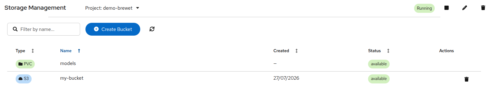

### Creating an S3 bucket

Click **Create Bucket** and enter a name. S3 bucket naming rules apply:

- 3–63 characters long
- Starts and ends with a letter or number
- Only lowercase letters, numbers, hyphens, and periods
- No consecutive periods or period-hyphen combinations
- Must not look like an IP address

### Deleting an S3 bucket

Click the trash icon on an S3 bucket row. A confirmation dialog requires you to type the bucket name. All objects in the bucket will be permanently deleted. PVC locations cannot be deleted from this page — manage them through OpenShift directly.

## Settings

The Settings page has six tabs for configuring the storage backend. Settings modified here are applied immediately to the running backend. Non-S3 settings (HuggingFace, proxy, performance) are also persisted to a Kubernetes Secret so they survive container restarts. S3 settings are loaded from your Data Connection and are in-memory only — to change them permanently, update the Data Connection in the RHOAI dashboard.

### S3 Storage

Configure the S3 connection used by the storage backend:

- **Endpoint URL** — The S3-compatible endpoint (e.g., your MinIO or AWS S3 URL).
- **Access Key ID** and **Secret Access Key** — Your S3 credentials. The secret key is masked by default; click the eye icon to reveal it.
- **Region** — The S3 region (e.g., `us-east-1`).
- **Default Bucket** — An optional default bucket to select when opening the Storage Browser.

Click **Save** to apply the settings. Click **Test Connection** to verify that the credentials and endpoint are valid — a success or failure message appears.

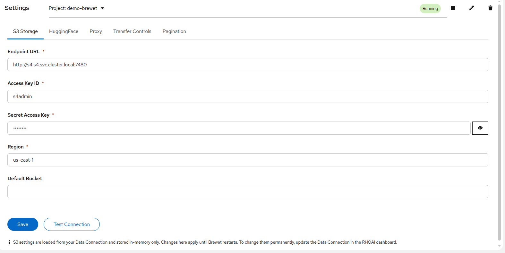

### HuggingFace

Set the API token used for HuggingFace imports:

- **API Token** — Your HuggingFace access token (starts with `hf_`). Required for downloading gated models.

Click **Test Connection** to validate the token — on success, the token's display name is shown.

### Proxy

Configure HTTP/HTTPS proxies for outbound connections (S3, HuggingFace):

- **HTTP Proxy** — Proxy URL for HTTP connections.
- **HTTPS Proxy** — Proxy URL for HTTPS connections.
- **Test URL** — A URL to test proxy connectivity against (only used for the test, not saved).

### Transfer Controls

Control how many file transfers run in parallel:

- **Max Concurrent Transfers** — A slider from 1 to 20 (default: 2). Higher values speed up bulk transfers but use more memory and network bandwidth.

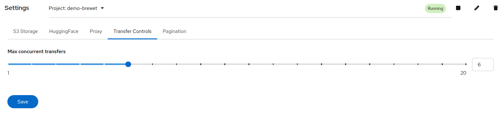

### Pagination

Control how many files are loaded per page in the Storage Browser:

- **Max Files Per Page** — A slider from 10 to 1000 (default: 100). Higher values show more files at once but increase load times for large directories.

### File Types

Control which file extensions are allowed or blocked for uploads. By default, Brewet allows common ML, data, text, archive, image, audio/video, notebook, document, and web file types, and blocks executable and script file types (except Python).

- **Allowed file extensions** — A comma-separated list of extensions that can be uploaded (e.g., `.safetensors, .bin, .py, .csv, .json`). Only files matching this list are accepted.
- **Blocked file extensions** — A comma-separated list of extensions that are always rejected (e.g., `.exe, .dll, .sh`). Blocked extensions take priority over allowed extensions.

Both fields support glob/wildcard patterns:

- `.p*` matches any extension starting with `.p` (e.g., `.py`, `.pl`, `.php`)
- `*` matches any extension (effectively disabling the restriction)

Leave both fields empty to use the built-in defaults. Settings are persisted and survive container restarts.
